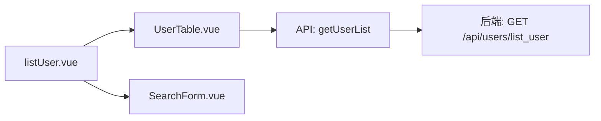
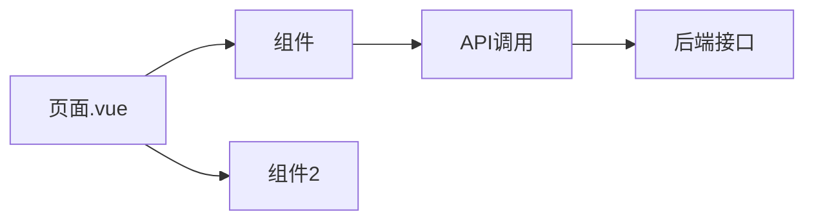
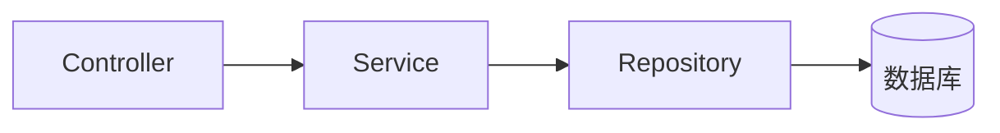
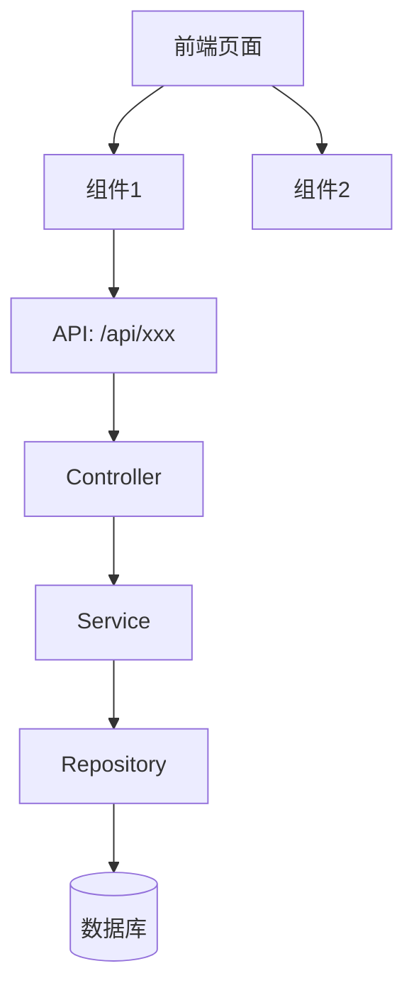

# 如何分析生成 md 文件

## 一、分析对象

### 1.1 需要分析

| 类型 | 文件 | 说明 |
|------|------|------|
| 前端页面 | .vue, .tsx, .jsx | 分析组件引用、API调用 |
| 后端控制器 | *_controller.py, *Controller.java | 分析路由、方法、调用Service |

### 1.2 不需要分析（跳过）

| 类型 | 说明 |
|------|------|
| 实体/模型类 | User.java, User.py, models/*.py |
| 配置类 | config.*, *Config.*, application.* |
| 工具类 | utils/*, helpers/*, *Util.* |
| 中间件 | middleware/*, *Middleware.* |
| 常量/枚举 | *Constant.*, *Enum.* |
| 公共组件 | components/common/* |
| 样式文件 | *.css, *.scss, *.less |
| 类型定义 | types/*, *Type.*, interfaces/* |

---

## 二、前端页面分析

### 2.1 分析内容

读取页面文件，提取：

1. **基本信息**
   - 文件路径
   - 功能描述（一句话）

2. **组件引用**
   ```javascript
   import UserTable from '@/components/user/UserTable.vue'
   import SearchForm from '@/components/user/SearchForm.vue'
   ```

3. **API 调用**
   ```javascript
   import { getUserList } from '@/api/user'
   getUserList({ page: 1, size: 10 })
   ```

4. **子组件**
   ```vue
   <template>
     <UserTable />
     <SearchForm />
   </template>
   ```

### 2.2 输出格式

```markdown
# 用户列表页

## 基本信息
- 路径：src/views/user/listUser.vue
- 功能：展示用户列表，支持搜索和分页
- 模块：用户管理

## 调用链路



## 组件说明

| 组件 | 路径 | 作用 |
|------|------|------|
| UserTable | components/user/UserTable.vue | 用户表格展示 |
| SearchForm | components/user/SearchForm.vue | 搜索表单 |

## API 调用

| API函数 | 请求路径 | 方法 | 参数 |
|---------|----------|------|------|
| getUserList | /api/users/list_user | GET | page, size, keyword |

## 数据流
1. 页面加载 → 调用 getUserList
2. 后端返回分页数据
3. UserTable 渲染表格
```

---

## 三、后端接口分析

### 3.1 分析内容

读取控制器文件，提取：

1. **基本信息**
   - 路由路径
   - HTTP 方法
   - 控制器类和方法

2. **调用 Service**
   ```python
   class UserController:
       def list_user(self):
           service = UserService()
           return service.get_user_page(...)
   ```

3. **Service 方法**
   ```python
   class UserService:
       def get_user_page(self, page, size, keyword):
           repo = UserRepository()
           return repo.find_all(...)
   ```

4. **Repository 方法**
   ```python
   class UserRepository:
       def find_all(self, filters):
           # SQL: SELECT * FROM user WHERE ...
           pass
   ```

### 3.2 输出格式

```markdown
# list_user 接口

## 基本信息
- 路径：GET /api/users/list_user
- 控制器：UserController.list_user()
- 位置：controllers/user_controller.py:15
- 模块：用户接口

## 调用链路


## 请求参数
| 参数 | 类型 | 必填 | 说明 |
|------|------|------|------|
| page | int | 否 | 页码，默认1 |
| size | int | 否 | 每页条数，默认10 |
| keyword | string | 否 | 搜索关键字 |

## 响应数据
| 字段 | 类型 | 说明 |
|------|------|------|
| code | int | 状态码 |
| data | array | 用户列表 |

## 业务逻辑
- 分页查询用户
- 数据权限过滤
- 支持 keyword 模糊搜索

## 数据库操作
- 表：user
- 操作：SELECT
```

---

## 四、Mermaid 链路图

### 4.1 前端链路


### 4.2 后端链路


### 4.3 完整链路


---

## 五、命名规则

| 规则 | 前端 | 后端 |
|------|------|------|
| 文件名 | 中文 | 英文+下划线 |
| 模块目录 | 中文 | 中文 |
| 链接路径 | 相对路径 | 相对路径 |

### 示例
```
.txcode/wiki/
├── frontend/
│   └── 用户管理/
│       └── 用户列表.md
└── backend/
    └── 用户接口/
        └── list_user.md
```
